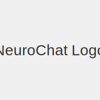

# NeuroChat



## A Simple React GUI for Ollama AI

Welcome to **NeuroChat**, a powerful and intuitive web-based chat interface that allows you to interact with locally running Large Language Models (LLMs) via Ollama. This project provides a seamless experience for developers and users to chat with AI models directly from their web browser, offering a personal AI you can build with.

## 🚀 Features

*   **Interactive Chat Interface:** A clean and responsive UI designed to feel like a messaging app, with user prompts on one side and AI responses on the other.
*   **Ollama Integration:** Seamless communication with your locally running Ollama instance using the `http://localhost:11434/api/generate` endpoint.
*   **Real-time AI Responses:** Get instant replies from your chosen LLM.
*   **Loading Spinner:** A visual indicator to show when the app is waiting for an AI response.
*   **AI Response Metrics:** Displays useful metrics for AI responses, including duration, tokens per second, and total tokens generated.
*   **Customizable AI Model:** Easily switch between different Ollama models (e.g., `tinyllama`, `gemma:2b`) by updating the `App.tsx` file.

## ⚙️ Getting Started

Follow these steps to set up and run NeuroChat on your local machine.

### Prerequisites

Before you begin, ensure you have the following installed:

*   [Node.js](https://nodejs.org/) (which includes npm)
*   [Ollama](https://ollama.com/)

### Step 1: Install and Run Ollama

Ollama allows you to run open-source large language models locally. If you haven't already, install Ollama for your operating system:

*   **Windows:** Download the [Windows version from the official Ollama website](https://ollama.com/download/windows).

Once installed, Ollama will run in the background.

#### Download an AI Model

Next, you'll need to download an AI model to use with Ollama. We recommend a model less than 1GB for a good balance of performance and resource usage. For example, to pull the `tinyllama` model:

1.  **Browse the Library:** Go to the [official Ollama Library](https://ollama.com/library) to explore available models.
2.  **Choose a Model:** Select a model that fits your needs (e.g., `tinyllama`).
3.  **Copy the Pull Command:** On the model's page, you'll find the exact command to download it (e.g., `ollama pull tinyllama`).
4.  **Run the Command:** Open your terminal and paste the command:
    ```bash
    ollama pull tinyllama
    ```
    This might take a few minutes as it's a large file.

You can verify the model is running by typing `ollama list` in your terminal. You should see your chosen model in the list.

### Step 2: Set Up and Run the React App

1.  **Navigate to the `interface` directory:**
    ```bash
    cd interface
    ```

2.  **Install dependencies:**
    ```bash
    npm install
    ```

3.  **Start the development server:**
    ```bash
    npm run dev
    ```

    The application will start, and you can access it in your web browser, typically at `http://localhost:5173`.

## 💡 Usage

Open your web browser and navigate to the address provided by `npm run dev` (e.g., `http://localhost:5173`).

*   Type your prompt into the input field at the bottom of the chat interface.
*   Press `Enter` or click the `Send` button to send your message.
*   The AI's response will appear in the chat display, along with performance metrics.

## 🛠️ Technologies Used

*   **React:** A JavaScript library for building user interfaces.
*   **TypeScript:** A typed superset of JavaScript that compiles to plain JavaScript.
*   **Vite:** A fast build tool for modern web projects.
*   **Ollama:** A framework for running large language models locally.
*   **HTML & CSS:** For structuring and styling the web application.

## License

This project is open-source and available under the [MIT License](LICENSE).
